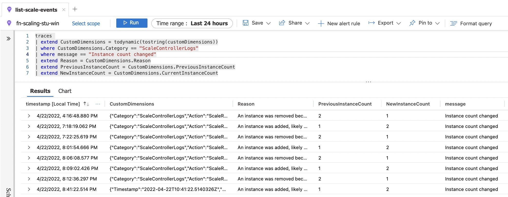

# loadtest-azure-fn
Example script to load test an azure function to show scaling

## Setup 
1. install Artillery
```
npm install -g artillery@latest
```
2. verify installation
```
artillery dino
```
3. execute test against example api
```
artillery run artillery-test-example.yml
```

## Deploy Azure function
1. Create a Function App
2. Install extension in VSCode: [Azure Tools](https://marketplace.visualstudio.com/items?itemName=ms-vscode.vscode-node-azure-pack)
3. either create a new function app or locate an existing one which can be overwritten
4. right click on the function app and choose **Deploy to Function App...**

## Test Azure function
1. update the target url in *artillery-test-fn.yml*
```yaml
config:
  target: "https://YOURNAME.azurewebsites.net/api/HttpTrigger2"

```
3. execute test against the function
```
artillery run artillery-test-fn.yml
```
## Monitoring
| :warning: WARNING          |
|:---------------------------|
| Azure Functions premium hosting plan offers scale controller logs in preview      |

- [Metrics](https://docs.microsoft.com/en-us/azure/azure-functions/monitor-metrics?tabs=portal) show the request count
- You can enable [scale controller logs (preview)](https://docs.microsoft.com/en-us/azure/azure-functions/configure-monitoring?tabs=v2#configure-scale-controller-logs) - you need to add an appsetting ```SCALE_CONTROLLER_LOGGING_ENABLED=AppInsights:Verbose``` using the portal or a script as per below
```bash
az functionapp config appsettings set --name <FUNCTION_APP_NAME> \
--resource-group <RESOURCE_GROUP_NAME> \
--settings SCALE_CONTROLLER_LOGGING_ENABLED=AppInsights:Verbose
```
- you can then [query your scale controller logs](https://docs.microsoft.com/en-us/azure/azure-functions/analyze-telemetry-data#query-scale-controller-logs)
- example Kusto Query
```pwsh
traces 
| extend CustomDimensions = todynamic(tostring(customDimensions))
| where CustomDimensions.Category == "ScaleControllerLogs"
| where message == "Instance count changed"
| extend Reason = CustomDimensions.Reason
| extend PreviousInstanceCount = CustomDimensions.PreviousInstanceCount
| extend NewInstanceCount = CustomDimensions.CurrentInstanceCount
```
### Sample logs


## Creating an alert
To create an Alert based on log query you can follow the [Azure Docs Tutorial](https://docs.microsoft.com/en-us/azure/azure-monitor/alerts/tutorial-log-alert)

## Useful links
- [Scale](https://docs.microsoft.com/en-us/azure/azure-functions/functions-scale#scale) information for Azure Functions based on hosting plan
- Premium - [max scalout](https://docs.microsoft.com/en-us/azure/azure-functions/functions-premium-plan?tabs=portal#region-max-scale-out)


## Example scenario - Premium functions
Based on pricing in AU$ at April 2022 (No EA discounts included)

Azure functions premium has minumum of one running instance at all times. Scaling out to more instances and back in occurs automatically based on load. Scaling in back to a single instance may take 5-10 minutes after load reduces.

### Sample costs
- Premium function instance **730 hours** = 885.32
- 3 Additional instances during **184 working hours** = 669.45
- Estimated monthly total = 1,554.77

Example calculator:
https://azure.com/e/cb7b654e276a4569b6b807c47ed52861